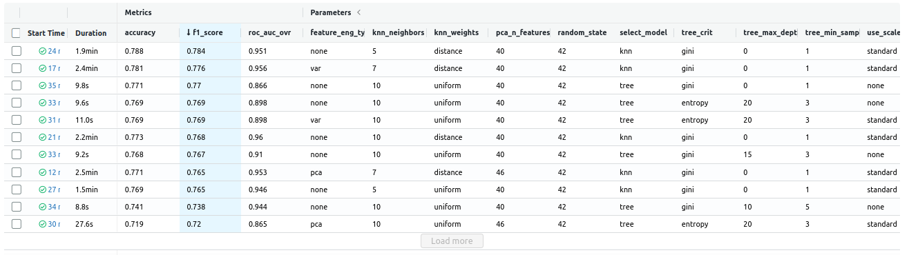

# evaluation_selection_hw_9
Capstone project for RSschool ml-course

This project uses [Forest CoverType](https://kaggle.com/competitions/forest-cover-type-prediction) dataset.

## Usage
This package allows you to train model for forest cover type prediction.

1. Clone this repository to your machine
2. Download [Forest CoverType](https://kaggle.com/competitions/forest-cover-type-prediction) dataset, 
extract it to `data/raw/` in directory's root
3. Use Python 3.9 and [Poetry](https://python-poetry.org/docs/) 1.1.11
4. Install project dependencies:
```sh
poetry install --no-dev
```
5. Run train with the following command:
```sh
poetry run train -d <path to csv with data> -s <path to save trained model>
```
You can pass many other options(select model and choose hyperparameters) in the CLI
To get full list run this:
```sh
poetry run train --help
```
6. Run MLflow to see tracked experiments(models, perameters and metrics):
```sh
poetry run mlflow ui
```
Here are the results of running 2 models with different parameters and two feature 
engineering techniques.
(Because my machine was so slow i had change logistic regression for KNN and use the simplest 
of approaches for feature selection and even then, 
as you can see from mlflow screenshot the evaluations were just painfully long.
But I ran some experiments in Colab e.g. tried LogisticRegression L1-regularized feature elimination and it didn't show wonderful results on used dataset, so some further research and experiments TBD)

## Development

Install all requirements (including dev requirements) to poetry environment:
```
poetry install
```
Now you can use developer instruments.
I also added `pandas-profiling` to dev-dependencies because it takes too long to install.
You can run `generate-eda-report.py` to get profiling of the dataset, it will be stored in
`report/` folder

Format your code with [black](https://github.com/psf/black) formatter:
```
poetry run black src tests
```